# ERD — Haksan ERP

Mermaid diagram (GitHub'da otomatik render olur).

```mermaid
erDiagram
  TENANTS ||--o{ USERS : has
  TENANTS ||--o{ DEPARTMENTS : has
  TENANTS ||--o{ ROLES : has
  TENANTS ||--o{ COMPANIES : has
  TENANTS ||--o{ BRANDS : has
  TENANTS ||--o{ PRODUCT_MODELS : has
  TENANTS ||--o{ WAREHOUSES : has
  TENANTS ||--o{ INVENTORY_ITEMS : has
  TENANTS ||--o{ OPPORTUNITIES : has
  TENANTS ||--o{ QUOTES : has

  USERS ||--o{ USER_ROLES : has
  ROLES ||--o{ USER_ROLES : has
  ROLES ||--o{ ROLE_PERMISSIONS : has
  PERMISSIONS ||--o{ ROLE_PERMISSIONS : has

  USERS ||--o{ LOGIN_SESSIONS : has
  USERS ||--o{ REFRESH_TOKENS : has
  USERS ||--o{ PASSWORD_RESET_TOKENS : has

  COMPANIES ||--o{ COMPANY_ADDRESSES : has
  COMPANIES ||--o{ COMPANY_PHONES : has
  COMPANIES ||--o{ COMPANY_EMAILS : has
  COMPANIES ||--o{ CONTACTS : has
  CONTACTS ||--o{ CONTACT_PHONES : has
  CONTACTS ||--o{ CONTACT_EMAILS : has
  CONTACTS ||--o{ CONTACT_NOTES : has

  COMPANIES ||--o{ LEADS : has
  COMPANIES ||--o{ OPPORTUNITIES : has
  OPPORTUNITIES ||--o{ OPPORTUNITY_STAGE_HISTORY : has
  OPPORTUNITIES ||--o{ SALES_ACTIVITIES : has
  OPPORTUNITIES ||--o{ VISITS : has
  OPPORTUNITIES ||--o{ CALLS : has
  OPPORTUNITIES }o--|| PIPELINE_STAGES : current_stage

  COMPETITORS ||--o{ COMPETITOR_PRODUCTS : has
  OPPORTUNITIES }o--o| COMPETITORS : lost_to

  BRANDS ||--o{ PRODUCT_MODELS : has
  PRODUCT_MODELS ||--o{ PRODUCT_SPECS : has
  PRODUCT_MODELS ||--o{ PRODUCT_EQUIPMENT_ITEMS : has
  PRODUCT_MODELS ||--o{ PRODUCT_MEDIA : has
  PRODUCT_MODELS ||--o{ PRICE_LIST_ITEMS : has
  PRICE_LISTS ||--o{ PRICE_LIST_ITEMS : has

  PRODUCT_MODELS ||--o{ INVENTORY_ITEMS : has
  WAREHOUSES ||--o{ INVENTORY_ITEMS : has
  INVENTORY_ITEMS ||--o{ INVENTORY_MOVEMENTS : has
  INVENTORY_ITEMS ||--o| CUSTOMER_DEVICES : becomes

  OPPORTUNITIES ||--o{ QUOTES : has
  QUOTES ||--o{ QUOTE_ITEMS : has
  QUOTES ||--o| QUOTE_TERMS : has
  QUOTES ||--o{ QUOTE_FILES : has
  QUOTES ||--o| PROFORMAS : has
  QUOTES ||--o| CONTRACTS : has
  QUOTES ||--o| COMMERCIAL_INVOICES : has

  QUOTES ||--o{ RECEIVABLES : creates
  RECEIVABLES ||--o{ PAYMENTS : has

  OPPORTUNITIES ||--o{ INSTALLATION_JOBS : has
  CUSTOMER_DEVICES ||--o{ SERVICE_TICKETS : has
  OPPORTUNITIES ||--o{ SHIPMENTS : has

  FILES ||--o{ FILE_LINKS : has
```

## Notlar

- `tenant_id` her ana tabloda ama diagram için kaldırıldı (görsel sade kalsın diye).
- Lookup tabloları (pipeline_stages, currencies, ...) diagram'da gösterilmedi ama her yerden referans alınır.
- Soft delete (`deleted_at`) ana tablolarda var.
- audit_logs herhangi bir tabloya FK koymaz — `resource_type` + `resource_id` polimorfik.
